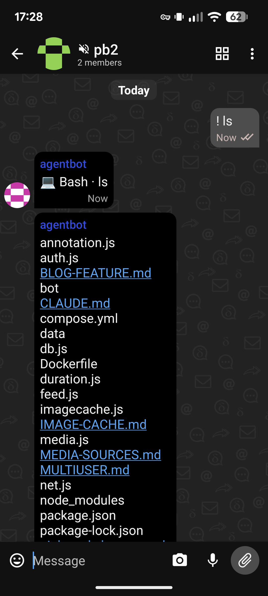
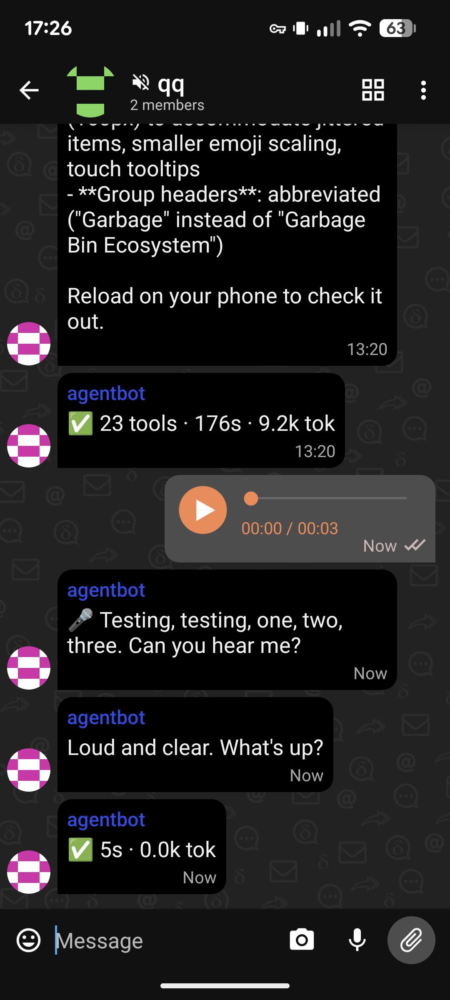
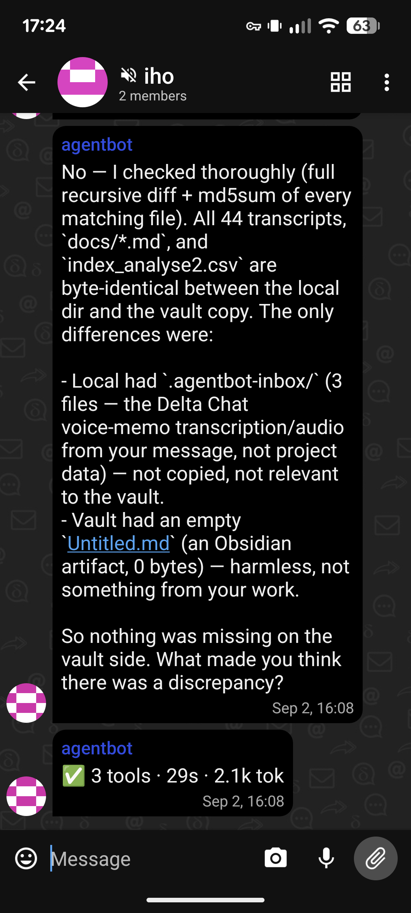
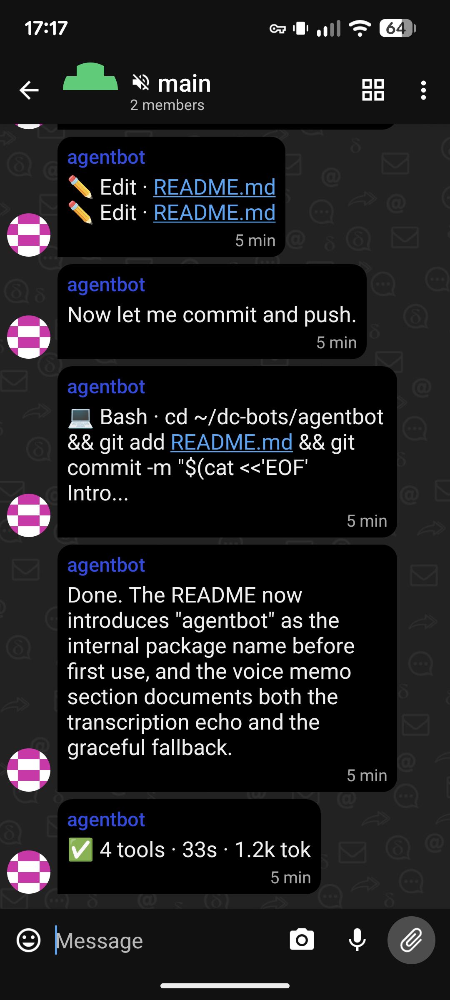

# deltachat-claude-code

A Delta Chat portal to the [Claude Code](https://docs.anthropic.com/en/docs/claude-code)
CLI on any machine you own. Each chat is an independent Claude subprocess with
filesystem access, bash, git, tools, and slash commands — identical to sitting at
the terminal, but from your phone.

Unlike claude.ai/code, which runs in an ephemeral cloud sandbox, this runs on
your actual machine — your repos, your running services, your databases, your
SSH keys. Install it on a dev server, a home lab box, or a laptop, and you have
full Claude Code access from anywhere.

~400 lines of Python. No frameworks, no containers, no build step.

The package is internally called **agentbot** — you'll see that name in file
paths, systemd units, and the sections below.

## Screenshots

| Bash output | Voice memo | Conversation | Git workflow |
|:---:|:---:|:---:|:---:|
|  |  |  |  |
| Tool output in a project chat | Transcription echo before Claude responds | Multi-turn conversation with file analysis | Committing and pushing from chat |

## Why

A Delta Chat bot that proxies full Claude Code CLI sessions — not an API
wrapper, not a chatbot skin, but the real thing over a chat transport.

### It's not an API wrapper

Most chat-to-AI bots call `anthropic.messages.create` and relay the response.
Agentbot shells out to the actual `claude` CLI binary. That means you get
everything a terminal session gets: file editing, bash execution, git operations,
multi-step tool chains, code review, subagents, CLAUDE.md project context, skills,
and the full slash-command surface. The bot is a transport layer, not a
reimplementation.

### Your prompts stay on your machine

When you use a Telegram or Discord bot, every message — your prompts, your code
context, your file contents — routes through that platform's servers. Agentbot
runs on hardware you own, and Delta Chat is email under the hood: messages travel
between your device and a [chatmail](https://chatmail.at) relay. No third-party
platform sees your conversation. If you're sending prompts that reference
proprietary code, credentials paths, or infrastructure details, this matters.

### No account, no phone number, no platform

Delta Chat doesn't require a signup, a phone number, or a platform account. You
install the app, it generates a chatmail address, and you're chatting. No Terms of
Service for a chat platform you don't care about, no 2FA enrollment, no contact
list upload. This is the lowest-friction path from "I have a server" to "I'm
talking to it from my phone." Telegram, Discord, and Signal all require more
onboarding than the bot itself.

### Cumulative transcript

Claude Code sessions are ephemeral — they live in a terminal that scrolls away,
and resuming one drops you into the middle of a context window with no readable
history. Agentbot turns every session into a scrollable chat thread. Days of work
on a project accumulate as a single, searchable conversation you can scroll back
through. For long-running projects, this becomes the most useful record of what
was done, what was decided, and why — more readable than git log, more complete
than commit messages. The Delta Chat thread *is* the project diary.

### Session portability

A session started from your phone can be resumed from a terminal
(`claude --resume <id>`), and vice versa. The underlying `.jsonl` session file is
the same one Claude Code uses natively. You're not locked into the chat interface;
it's just another way in.

### Voice memos

With optional [faster-whisper](https://github.com/SYSTRAN/faster-whisper)
integration, you can send voice memos and they'll be transcribed before reaching
Claude. The bot echoes the transcription back to you first, so you can verify
what Claude received and correct any mistakes. If faster-whisper isn't installed,
the bot tells you how to enable it instead of failing silently.

### Simple enough to trust

The entire bot is ~400 lines of Python across seven files. No frameworks, no
containers, no build step, no dependencies beyond `deltachat-rpc-client` and
`pillow`. You can read every line in twenty minutes. It runs as a systemd service.
If it breaks, `journalctl -u agentbot -f` tells you why.

## Architecture

```
bot.py          event loop: DC message in → slash command or session.send_user()
session.py      Session wraps `claude -p --stream-json` subprocess; SessionManager
                caps concurrent processes, idle-reaps after timeout
render.py       stream-json events → coalesced DC messages + emoji reactions (⏳/✅/❌)
commands.py     slash router: /new, /clear, /exit, /resume, /model, /mode, /commission, etc.
store.py        SQLite: chat↔session bindings, per-turn usage tracking
avatar.py       random identicon avatars for commissioned project chats
transcribe.py   optional faster-whisper voice memo transcription
provision.py    one-time setup: creates chatmail account, avatar, systemd unit
```

## Prerequisites

- A Linux machine with [Claude Code](https://docs.anthropic.com/en/docs/claude-code)
  installed and authenticated (`claude` on your PATH)
- Python 3.11+
- [Delta Chat](https://delta.chat) on your phone (or any device)

## Setup

```bash
git clone https://github.com/maphouse/deltachat-claude-code
cd agentbot

# Create a virtualenv and install dependencies
python3 -m venv venv
source venv/bin/activate
pip install -r requirements.txt

# Optional: voice memo transcription (sends a helpful message if
# you skip this and later send a voice memo)
pip install -r requirements-voice.txt

# Configure
cp config.example.toml config.toml
# Edit config.toml: set admin_addresses, allowed_roots, default_cwd

# Provision (creates chatmail account, avatar, systemd unit)
python3 provision.py
```

Provisioning prints the bot's chatmail address. Open Delta Chat on your phone,
tap "New Chat," and enter that address. Send any message to start a session.

### Running

```bash
# Foreground (for testing)
python3 -m agentbot

# As a systemd service (provisioning installs this)
sudo systemctl enable --now agentbot.service
journalctl -u agentbot -f   # watch logs
```

## Commands

### Session control

| Command | What it does |
|---|---|
| `/new [dir]` | Fresh session, optionally in a different directory |
| `/clear` | Restart session in the same directory |
| `/exit` | End session — prints a `claude --resume` command for terminal pickup |
| `/resume <id>` | Resume a previous session by ID |
| `/sessions` | List bound chats and recent sessions on disk |
| `/stop` | Interrupt a running turn |

### Settings

| Command | What it does |
|---|---|
| `/model [name]` | Show or set model (sonnet, opus, haiku, fable, or full ID) |
| `/mode [name]` | Show, set, or cycle permission mode |
| `/cwd [path]` | Show or change working directory |
| `/effort [level]` | Show or set effort (low, medium, high, xhigh, max) |
| `/verbose [on\|off]` | Toggle tool and thinking visibility in chat |
| `/maxsessions [n]` | Show or set max concurrent Claude subprocesses |

### Info

| Command | What it does |
|---|---|
| `/usage` | Session, today, and weekly stats (turns, tokens, context fill) |
| `/help` | All bot commands plus Claude Code's own command list |
| `/commission <name> [dir]` | Create a new group chat bound to a project directory |

### Passthrough

Any `/command` not listed above is forwarded to Claude Code as-is — so
`/code-review`, `/security-review`, `/init`, `/compact`, and all other Claude Code
slash commands work.

## Project chats

Use `/commission <name> [dir]` to create a dedicated group chat for a project.
Each commissioned chat gets its own session, working directory, and randomly
generated identicon avatar. This is how you keep multiple long-running projects
separate — the pinboard2 chat doesn't share context with the basemaps chat.

## Security

The `admin_addresses` list in `config.toml` is the **only access control**. The
bot runs with `bypassPermissions`, meaning Claude Code will execute any tool
without confirmation. This is deliberate — confirmation prompts can't work over
chat — but it means the allowlist is load-bearing. Only add addresses you trust
with full shell access to the machine.

## Resource usage

The bot itself is lightweight (~20 MB RSS). The cost is in the Claude Code
subprocesses it manages — each one is a full Node.js process.

| Component | RAM | Notes |
|---|---|---|
| agentbot (Python) | ~20 MB | Always resident while the service is running |
| Each Claude Code session | ~300 MB | One per active chat; idle sessions are reaped |
| faster-whisper (optional) | ~200 MB | Loaded per transcription, then released |

With the default `max_live_sessions = 3`, peak usage is roughly **1 GB** (bot +
3 sessions). Idle-reaped sessions release their memory; sending a new message
respawns the subprocess.

**Minimum:** 2 GB free RAM is comfortable for typical use (1-2 concurrent
sessions). Whisper memory is transient — it loads for each voice memo and
releases after. Machines with 4 GB+ total RAM should have no issues.

The bot uses negligible CPU when idle. CPU spikes briefly when Claude Code
processes a turn, but the actual inference happens on Anthropic's servers — your
machine just runs the tool calls (bash, file I/O, git).

## Limits

- **Concurrent subprocess cap** (default 3). You can have unlimited project chats,
  but only this many can have a live Claude Code process at once. If you message a
  chat beyond the limit, the least-recently-used subprocess is terminated to make
  room. Nothing is lost — the session resumes automatically on the next message.
  Adjust at runtime with `/maxsessions <n>`, or permanently in `config.toml`.
- **Idle reaping** (default 30 minutes). Inactive sessions are terminated to free
  memory (~300 MB per subprocess). The session resumes transparently when you send
  the next message. Configure with `idle_timeout_min` in `config.toml`.
- Messages split at 4000 chars
- Attachments saved to `.agentbot-inbox/` in the session's working directory

## Known limitations

- **No plan usage visibility.** `/usage` shows context window fill and
  session-level token counts, but can't show how much of your Claude Pro/Max
  subscription quota you've consumed — the CLI doesn't expose that. Check
  [claude.ai/settings](https://claude.ai/settings) for plan-level usage.
- **No interactive prompts.** The bot runs with `bypassPermissions` because
  confirmation dialogs can't work over chat. This is a security tradeoff,
  not a bug.
- **Text only.** Claude Code artifacts, HTML previews, and image outputs
  don't render in Delta Chat — you'll see the text description but not
  the visual.
- **Some slash commands need a TTY.** `/config`, `/keybindings`, `/loop`,
  and `/schedule` are blocked because they require interactive terminal input.

## License

MIT
