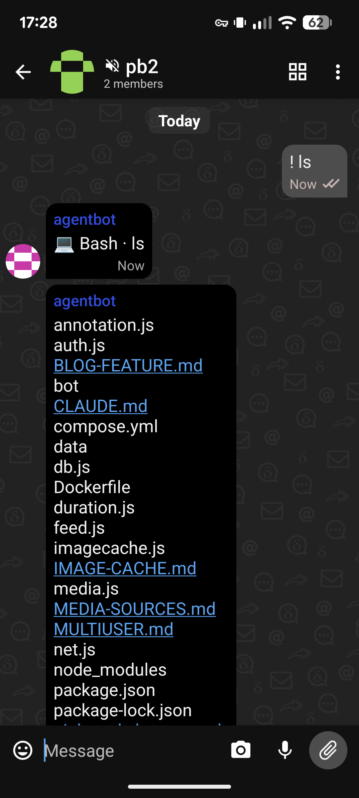
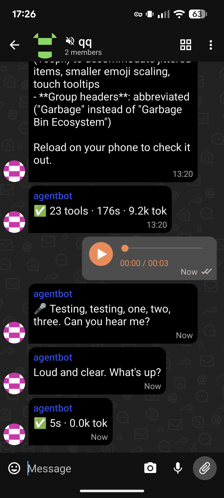
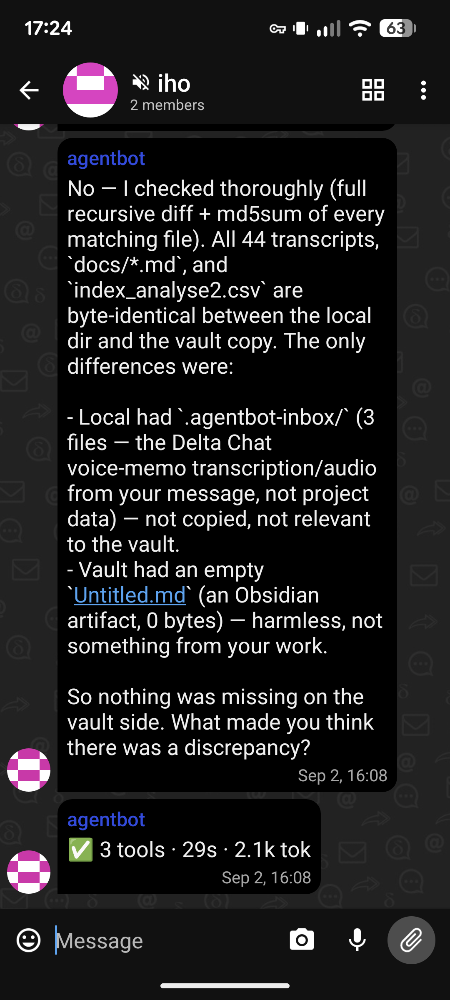
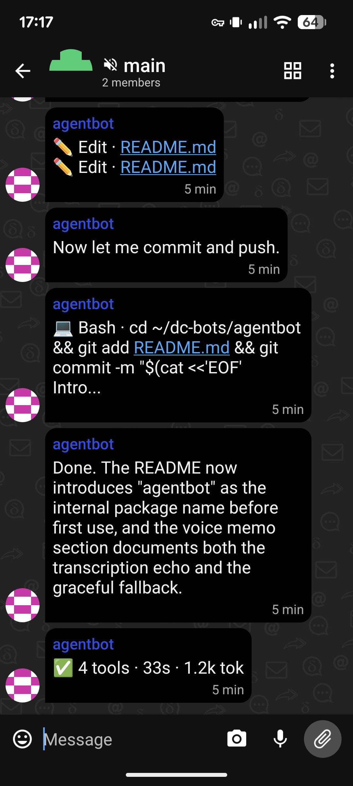

# deltachat-claude-code 

[](https://pypi.org/project/deltachat-claude-code/)
[](https://pypi.org/project/deltachat-claude-code/)
[](LICENSE)

**Access self-hosted Claude Code from your phone — full CLI sessions over encrypted chat, no signup needed.**

Host a bot that proxies full
[Claude Code](https://docs.anthropic.com/en/docs/claude-code) CLI sessions to any device via lightweight encrypted chat. This is not an API wrapper or a chatbot skin, it's the whole `claude` binary over a chat transport. Everything you get in a terminal session is bridged into an easy chat interface: file editing, bash, git,
multi-step tool chains, code review, subagents, CLAUDE.md context, and the full
slash-command surface.

[Delta Chat](https://delta.chat) is the messenger of choice here: a decentralized, encrypted chat system with no signup and that requires no
phone number, email or login: install it, add the bot as a contact, and start
prompting. See [why](#why) this is the best way to interact with Claude Code.

## Contents

- [Why](#why)
- [Screenshots](#screenshots)
- [Architecture](#architecture)
- [System requirements](#system-requirements)
- [How to setup](#how-to-setup)
- [Using Claude Code through the chat](#using-claude-code-through-the-chat)
- [Security](#security)
- [To note](#to-note)
- [Known limitations](#known-limitations)

## Why

- **Why Delta Chat?** Your prompts aren't stored anywhere but your machine. Delta Chat is
  decentralized, encrypted email under the hood, so no third-party platform ever sees your
  conversation. It also requires no account, no phone number, no signup: it's the lowest-friction path
  between "I have a server" and "I'm talking to it from any device."

- **Cumulative chat transcripts.** Claude Code session contexts are ephemeral: they live
  in a terminal that scrolls away. A project conversation turns every project
  into an infinitely scrollable, searchable chat thread, no matter how many sessions you created or /clear commands you used. The Delta Chat thread is a really useful project diary.

- **Reply-to context.** When you reply to a specific message in the chat, the
  quoted text is forwarded to Claude as context. Instead of re-explaining what
  you're referring to, just swipe-reply on the message and add your follow-up.
  This is something a terminal can't do — you can't "reply to" a specific line
  of output.

- **Project-based chats.** Use `/commission <name> <directory>` to create a dedicated group
  chat for a project in a given folder. Each commissioned chat gets its own session and identicon avatar (random pattern, color shared by chats in the same folder; `/avatar` regenerates it), and can carry its own system prompt and model on top of the folder's `CLAUDE.md` and settings.

- **Vibe code with friends.** The bot is a Delta Chat contact like any other, and a commissioned group chat is just a group chat. Add your other contacts to a chat with the agent and work on a project together (see [Sharing chats with guests](#sharing-chats-with-guests)).

- **Session portability.** A session started from your phone can be resumed from
  a terminal (`claude --resume <session-id>`), and vice versa. You're not locked into
  the chat interface; it's just another way in.

- **Voice memos.** With optional
  [faster-whisper](https://github.com/SYSTRAN/faster-whisper) integration, send
  voice memos and they'll be transcribed before reaching Claude. The bot echoes
  the transcription back so you can verify what Claude received.

- **Send and receive files via chat.** Send images for Claude to analyze; use
  `/send <path>` to deliver generated files (images, PDFs, build artifacts)
  from its directory back to your chat. Attachments you send it are saved to `.agentbot-inbox/` in the
  session's working directory.

- **Annotate responses for precision review.** Reply to any message with `/annotate` and that message opens inside a [small, secure in-chat artifact](https://webxdc.org/) you can comment on: tap words to select a phrase, comment on it, and
  send your notes back to the agent. The agent can then respond with a revised version within this in-chat app.

- **Auto-continue after rate limits.** Toggle `/continue-after-reset` and the
  bot will detect when Claude hits a session limit, parse the reset time from
  the message, and automatically resume the conversation one minute after the
  limit lifts — no need to watch the clock or come back to re-prompt.

## Screenshots

| Tool output in a project chat |Transcription echo before Claude responds | Multi-turn conversation with file analysis  |Committing and pushing from chat |
|:---:|:---:|:---:|:---:|
|  |  |  |  |


## Architecture

```
bot.py          event loop: DC message in → slash command or session.send_user()
session.py      Session wraps `claude -p --stream-json` subprocess; SessionManager
                caps concurrent processes, idle-reaps after timeout
render.py       stream-json events → coalesced DC messages + emoji reactions (⏳/✅/❌)
commands.py     slash router: /new, /clear, /exit, /resume, /model, /mode, /commission, etc.
store.py        SQLite: chat↔session bindings, per-turn usage tracking
avatar.py       random identicon avatars for commissioned project chats
transcribe.py   optional faster-whisper voice memo transcription
tts.py          optional piper text-to-speech for /listen
annotate.py     /annotate: webxdc annotation app (annotator/) ↔ Claude turns and revisions
provision.py    one-time setup: config.toml, chatmail account, avatar, systemd unit,
                owner invite link
```

## System requirements

### Prerequisites

- A Linux machine with [Claude Code](https://docs.anthropic.com/en/docs/claude-code)
  installed and authenticated (`claude` on your PATH)
- Python 3.11+
- [Delta Chat](https://delta.chat) on your phone (or any device)

### Resource usage

The bot itself is lightweight (~20 MB RSS). The cost is in the Claude Code
subprocesses it manages — each one is a full Node.js process.

| Component | RAM | Notes |
|---|---|---|
| Bot process | ~20 MB | Always resident while the service is running |
| Each Claude Code session | ~300 MB | One per active chat; idle sessions are reaped |
| faster-whisper (optional) | ~200 MB | Loaded per transcription, then released |

With the default `max_live_sessions = 3`, peak usage is roughly **1 GB** (bot +
3 sessions). Idle-reaped sessions release their memory; sending a new message
respawns the subprocess.

**Minimum:** 2 GB free RAM is comfortable for typical use (1-2 concurrent
sessions). Whisper memory is transient — it loads for each voice memo and
releases after. Machines with 4 GB+ total RAM should have no issues.

The bot uses negligible CPU when idle. CPU spikes briefly when Claude Code
processes a turn, but the actual inference happens on Anthropic's servers — your
machine just runs the tool calls (bash, file I/O, git).

## How to setup

### Install

```bash
pip install deltachat-claude-code

# Optional: voice memo transcription
pip install deltachat-claude-code[voice]
```

Or install from source:

```bash
git clone https://github.com/maphouse/deltachat-claude-code
cd deltachat-claude-code
pip install .            # or: pip install .[voice]
```

### Provision

Install and log in to Claude Code first (run `claude` once) as the user the bot
will run as. Then, in an empty directory for your bot instance:

```bash
mkdir my-bot && cd my-bot
deltachat-claude-code-provision
```

This writes `config.toml` (sessions start in your home directory), creates the bot's
chatmail account, installs the systemd unit, and prints an **owner invite link**. Open
the link in Delta Chat (tap it on your phone, or paste it into New Chat) and start the
bot. The first person to join through the link becomes the owner. The bot greets them,
and from then on ignores everyone else unless an owner shares a chat. Treat the link
like a password until you've claimed it. Re-running provisioning prints it again.

If the user has no sudo, provisioning leaves `agentbot.service` in the directory for an
admin to copy into `/etc/systemd/system/`.

To change where sessions run, or which models and limits are used, edit `config.toml`
(every option is commented) and restart the bot. More owners can be added by key
fingerprint under `admin_fingerprints`. When the bot ignores someone, it logs their
fingerprint.

### Running as a service

```bash
# Foreground (for testing)
deltachat-claude-code

# As a systemd service (provisioning installs this), internally called agentbot
sudo systemctl enable --now agentbot.service
journalctl -u agentbot -f   # watch logs
```

## Using Claude Code through the chat

Any `/command` not listed below is forwarded to Claude Code as-is — so
`/code-review`, `/security-review`, `/init`, `/compact`, and all other Claude Code
slash commands work.

### Commissioning chats

Use `/commission <name> [dir]` to create a dedicated group chat for a project.
Each commissioned chat gets its own session, working directory, and randomly
generated identicon avatar. Commissioned chats start out shared with all chat members (see below), and everyone in the chat
you ran `/commission` from is added to the new group.

Several chats can point at the same directory, so a chat can also carry its own frame:

```
/commission app-bugs ~/my-app --model claude-opus-5-5 --system-prompt 'Triage playtester bug reports. Reproduce before fixing. Don't refactor.'
```

- **Chat prompt** (`--system-prompt`) is appended to Claude Code's system prompt, on
  top of the directory's `CLAUDE.md`, and shown in the chat description. It survives
  `/clear` and `/new`. Change it later with `/prompt`. Quote it with straight or curly
  quotes; apostrophes inside are fine.
- **Model** (`--model`) overrides the directory's `.claude/settings*.json` for this chat
  only; Change it later with `/model`.

Every session also gets a basic **preamble**, an agentbot-wide system prompt telling Claude
it's talking over Delta Chat (concise replies, where attachments land). It's the
`preamble` key in `config.toml`; the chat's name, sharing status and chat
prompt are added after it. `/prompt` with no arguments combines all layers, displaying the bot's entire prompt.

### Sharing chats with guests

Owners are the profile that claimed the bot through its invite link, plus any profiles whose key fingerprints are in `admin_fingerprints`. They can use the bot in any chat. Anyone
else is a guest, and the bot only answers a guest in a chat an owner has shared:

| Command | What it does |
|---|---|
| `/share` | Let everyone in this chat use the bot (owner-only) |
| `/unshare` | Back to owners only (owner-only) |

- Commissioned chats are shared automatically.
- A shared chat only works for guests while at least one owner is still a member. If
  every owner leaves, the bot stops answering guests there.
- Guests can't share chats themselves, so adding the bot to a group without an owner
  gets them nothing. Adding an owner to their own group doesn't work either — an owner
  has to run `/share` there.
- Guests can use `/stop`, `/clear`, `/model`, `/effort`, `/verbose`, `/usage`, `/help`,
  `/listen` and `/annotate`. Every other bot command is owner-only. Claude Code's own slash commands
  (e.g. `/compact`) pass through as usual.
- `/annotate` notes arrive as webxdc updates, which don't carry a sender, so the bot
  only accepts them in chats where every member could use the bot anyway: all
  members are owners, or the chat is shared and still has an owner in it.
- The bot ignores anyone it won't serve without replying, so it doesn't spam group
  chats that haven't been shared.

### Session control inside a chat

These commands control the Claude Code session from inside a persistent chat.

| Command | What it does |
|---|---|
| `/new [dir]` | Fresh session, optionally in a different directory |
| `/clear` | Restart session in the same directory |
| `/exit` | End session — prints a `claude --resume` command for terminal pickup |
| `/resume <id>` | Resume a previous session by ID |
| `/sessions` | List bound chats and recent sessions on disk |
| `/stop` | Interrupt a running turn |

### Settings

| Command | What it does |
|---|---|
| `/model [name\|default]` | Show or set this chat's model (sonnet, opus, haiku, fable, or full ID); `default` defers to the directory's settings |
| `/prompt ['text'\|clear]` | Show or set this chat's system prompt (alias `/system-prompt`), applied from the next `/clear` or `/new` (owner-only) |
| `/mode [name]` | Show, set, or cycle permission mode |
| `/cwd [path]` | Show or change working directory |
| `/effort [level]` | Show or set effort (low, medium, high, xhigh, max) |
| `/verbose [on\|off]` | Toggle tool and thinking visibility in chat |
| `/maxsessions [n]` | Show or set max concurrent Claude subprocesses |
| `/continue-after-reset` | Toggle auto-continue after rate limit resets |

### Info

| Command | What it does |
|---|---|
| `/usage` | Session, today, and weekly stats (turns, tokens, context fill) |
| `/send <path>` | Send a file (image, PDF, etc.) from the server to this chat |
| `/listen` | Reply to a message to hear it as audio (TTS) |
| `/annotate` | Reply to a message to annotate it word by word in an in-chat app |
| `/help` | All bot commands plus Claude Code's own command list |


## Security

Access control has two layers: owners (whoever claimed the bot through its invite
link, plus the `admin_fingerprints` list in `config.toml`),
and the chats owners have shared with `/share` or `/commission`. The bot runs with
`bypassPermissions`, meaning Claude Code will execute any tool without confirmation.
This is deliberate — confirmation prompts can't work over chat — but it means both
layers are load-bearing. Only add fingerprints you trust with full shell access to the
machine. Owners are matched by key, never by address: a relay can't impersonate one, and
an owner who adds or switches relays stays an owner.

Until it's claimed, the invite link printed by provisioning (and logged at startup)
grants ownership to whoever uses it first, so keep it to yourself until you've joined.

`allowed_roots` only limits which directories `/new`, `/cd` and `/send` accept. It is
not a sandbox. Claude can read and write anything the bot's Unix user can, so to confine
the bot, run it as a dedicated user with access to only what it needs.

**Guests in a shared chat have that same shell access.** Limiting guests to certain
commands only limits the bot's own commands. Claude itself still runs as your Unix user,
with your permissions. A guest can ask it to read your SSH keys and API tokens, run
anything under your account, push to your git remotes, or leave the project directory.
Telling Claude not to do these things doesn't enforce anything. Only share a chat with
people you'd trust at your own terminal. Guest turns also count against your Claude
subscription. `/unshare` (or removing someone from the group) cuts off access right away.

## To note

- **Concurrent subprocess cap** (default 3). You can have unlimited chat groups,
  but only 3 can have a live Claude Code process at once. You can adjust this maximum
  at runtime with `/maxsessions <n>`, or permanently in `config.toml`. If you message a
  chat beyond the limit, the least-recently-used subprocess is terminated to make
  room. Nothing is lost — the session resumes automatically on the next message.
- **Idle reaping** (default 30 minutes). Inactive sessions are terminated to free
  memory (~300 MB per subprocess). The session resumes transparently when you send
  the next message. Configure with `idle_timeout_min` in `config.toml`.
- Messages are split at 4000 chars

## Known limitations

- **No plan usage visibility.** `/usage` shows context window fill and
  session-level token counts, but can't show how much of your Claude Pro/Max
  subscription quota you've consumed — the CLI doesn't expose that. Check
  [claude.ai/settings](https://claude.ai/settings) for plan-level usage.
- **No interactive prompts.** The bot runs with `bypassPermissions` because
  confirmation dialogs can't work over chat. This is a security tradeoff,
  not a bug.
- **No inline artifacts.** Claude Code artifacts and HTML previews don't
  render in Delta Chat. Generated files (images, PDFs) can be delivered
  to the chat with `/send <path>`.
- **Some slash commands need a TTY.** `/config`, `/keybindings`, `/loop`,
  and `/schedule` are blocked because they require interactive terminal input.

## License

MIT
